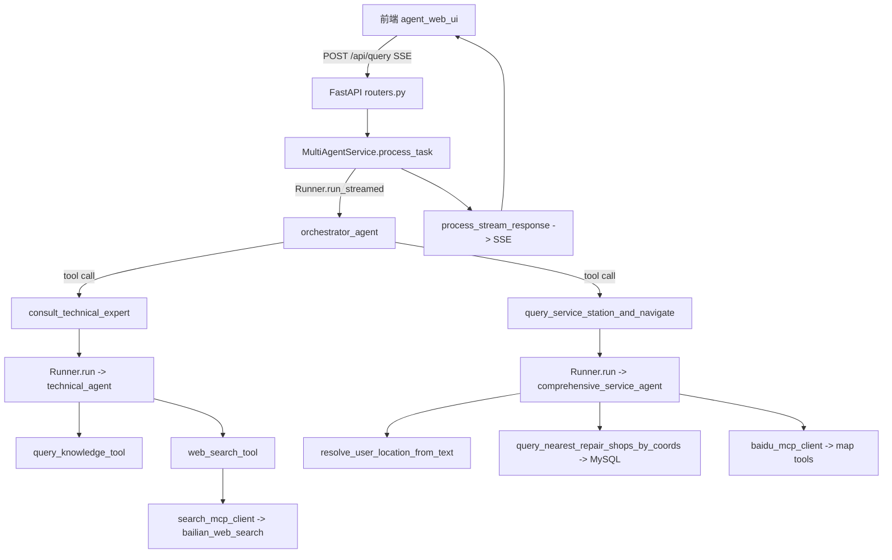
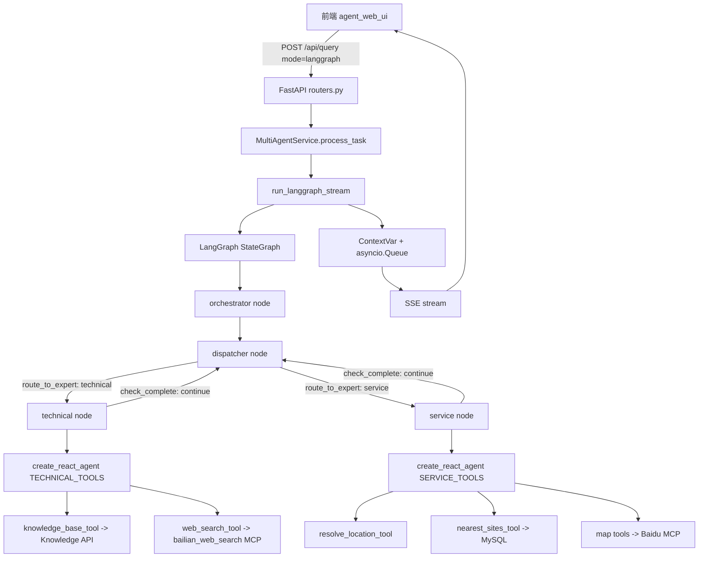
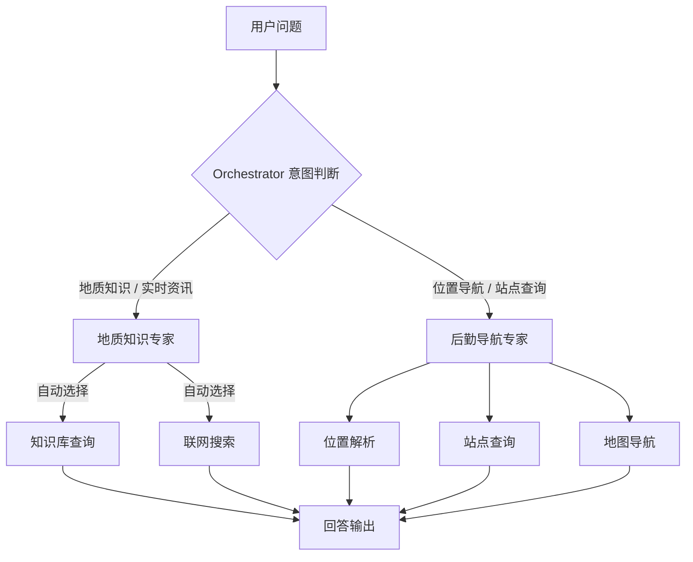
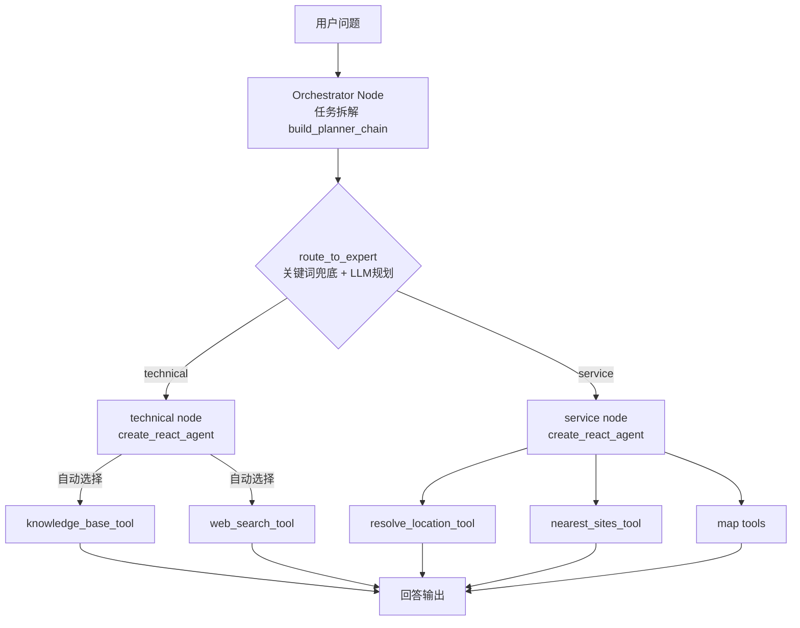
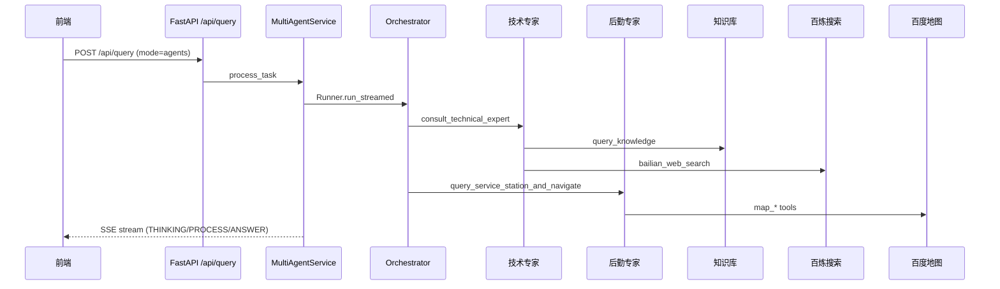
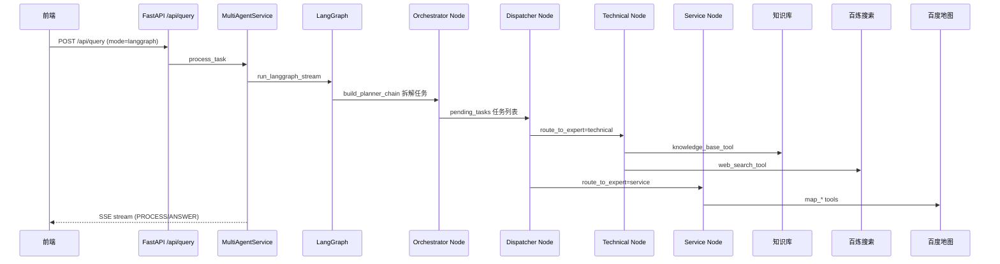

# GeoAssist 双架构多智能体系统技术文档

> 本文档合并了架构说明、核心机制对比、简历代码索引、开发困难与解决方案。

---

## 1. 总体能力清单（两种架构能力一致）

两种架构对外提供的能力保持一致：

1. **主调度（Orchestrator）**：识别意图、拆解任务、路由到专家
2. **地质知识专家（Technical Agent）**：
   - 查询知识库（RAG 服务）
   - 联网搜索（百炼 WebSearch MCP）
3. **野外后勤导航专家（Service Agent）**：
   - 位置解析（地址解析 / IP定位 / fallback）
   - 附近补给点/医疗点/站点查询（DB）
   - 导航链接生成（百度地图 MCP）
4. **流式输出（SSE）**：前端展示思考过程、工具调用过程、最终回答

---

## 2. 核心机制对比：两套架构如何"选择智能体"？

你可以把系统想象成"前台 + 专家团队"的服务大厅：

- **前台**负责听客户说话，判断该找谁。
- **专家**负责真正解决问题。

两套架构的差别在于：

- **架构 A（Agents SDK）**：前台本身是一个"会思考的 AI"，它直接决定找谁。
- **架构 B（LangGraph）**：前台先走"规则/路由器"，再决定去哪个专家。

### 2.1 架构 A：Agents SDK 的选智能体方式

**核心机制（一句话）**：

> **主调度智能体（Orchestrator）读你的问题，然后直接调用合适的专家工具。**

**具体过程**：

1. 请求进入 → `backend/app/api/routers.py`
2. 进入服务层 → `backend/app/services/agent_service.py`
3. 启动主调度智能体 → `backend/app/multi_agent/orchestrator_agent.py`
4. 根据 Prompt 决定调用哪个工具：
   - Prompt 文件：`backend/app/prompts/orchestrator_v1.md`
5. 真正的专家是工具（tool）：
   - 技术专家 tool：`backend/app/multi_agent/agent_factory.py::consult_technical_expert`
   - 后勤专家 tool：`backend/app/multi_agent/agent_factory.py::query_service_station_and_navigate`
6. 专家执行完后返回结果，调度智能体原样输出。

**判断标准**：

**完全靠 Prompt 里的文字规则**，核心位置在 `backend/app/prompts/orchestrator_v1.md`：

- "今天几号""最新勘探成果"→ 视为资讯类 → 技术专家
- "附近补给点""怎么去某地"→ 视为导航类 → 后勤专家

简单理解就是：**AI 看你的话像什么，就挑对应的专家。**

**优点和缺点**：

✅ 优点：简单直接、写 Prompt 就能扩展

⚠️ 缺点：容易"理解错"、路由规则只能靠文字提示约束

### 2.2 架构 B：LangGraph 的选智能体方式

**核心机制（一句话）**：

> **先用"Router Node"判断路由，再进入对应的专家节点。**

**具体过程**：

1. Router Node 先做"分类" → `backend/app/multi_agent_langgraph/routing.py`
2. 分类结果只有 2 个：`technical`（技术专家）或 `service`（后勤专家）
3. 如果是 `technical` → 进入 technical node → `graph.py::technical_node`
4. 如果是 `service` → 进入 service node → `graph.py::service_node`
5. 最后通过 SSE 输出结果 → `backend/app/multi_agent_langgraph/streaming.py`

**判断标准**：

LangGraph 的 Router Node 有**两层逻辑**：

1. **关键词兜底**（先判断是否包含关键字）
2. 若没命中，再让 LLM 通过 structured output 判断

代码位置：`backend/app/multi_agent_langgraph/routing.py`

```python
TECHNICAL_KEYWORDS = [
    "地质", "勘探", "矿", "岩", "地层", "矿物", "断层", "地震",
    "天气", "预警", "科研", "政策", "成果", "新闻", "今天", "几号", "几点",
    "鉴定", "取样", "地形", "沉积", "构造", "火山",
]
SERVICE_KEYWORDS = [
    "导航", "怎么去", "附近", "补给", "医疗", "村", "驻地", "营地",
    "路线", "位置", "撤离", "最近的", "怎么走",
]
```

判断逻辑：
- 包含"勘探/科研/政策/新闻/几号"等 → 直接 `technical`
- 包含"导航/附近/补给/医疗"等 → 直接 `service`

简单理解：**先用规则判，再用 AI 判。**

**优点和缺点**：

✅ 优点：更稳定、路由逻辑更可控、后续容易扩展更多分支

⚠️ 缺点：需要写路由逻辑（稍微复杂）

### 2.3 一句话对比总结

| 对比点 | Agents SDK | LangGraph |
| --- | --- | --- |
| 谁来决定"找谁" | AI 调度智能体 | Router Node（规则 + AI） |
| 判断依据 | Prompt 规则 | 关键词兜底 + LLM 分类 |
| 可控性 | 中等 | 更高 |
| 扩展性 | 适合小规模 | 适合多分支、多流程 |

### 2.4 真实例子对比

**例子 1：`最新勘探成果、地质科研新闻、政策变动`**

- Agents SDK：调度智能体理解为"资讯类" → 技术专家
- LangGraph：Router 命中"成果/科研/政策" → technical node
- 结果一致 ✅

**例子 2：`怎么去最近的补给点`**

- Agents SDK：调度智能体理解为"导航类" → 后勤专家
- LangGraph：Router 命中"补给" → service node
- 结果一致 ✅

**结论**：
- **Agents SDK**：更像"一个聪明前台在现场决定"
- **LangGraph**：更像"先走规则分流，再进入专家窗口"
- 轻量快速搭建 → Agents SDK 更方便
- 流程稳定可扩展 → LangGraph 更合适

### 2.5 路由关键词配置指南

位置：`backend/app/multi_agent_langgraph/routing.py`

**如何新增关键词？**

1. 找到用户常问的词
2. 直接加到对应列表
3. 重启后端即可生效

示例：
- 用户常问"灾害预警" → 加到 `technical_keywords`
- 用户常问"撤离路线" → 加到 `service_keywords`

**如何避免冲突？**

如果一个词可能属于两边：
- 把它放在你"更希望优先"的分类里
- 或者改用"组合词"来避免误判

例如："救援"可以是地质灾害也可能是导航
- "救援站/救援点"放在 `service`
- "灾害预警/灾害信息"放在 `technical`

**常见误判案例 + 解决方法**：

| 问题 | 误判原因 | 解决方法 |
| --- | --- | --- |
| 最新勘探成果、地质科研新闻 | 模型把"政策/新闻"理解成"服务咨询" | 把"成果/科研/政策/新闻"加入 technical_keywords |
| 怎么去最近的补给点 | 模型把"补给点"当成知识查询 | 把"补给/补给点/补给站"加入 service_keywords |
| 今天几号 | 模型把"今天"理解成闲聊 | 把"今天/几号/几点"加入 technical_keywords |
| 灾害预警和撤离路线 | 一句话包含两个任务 | 让 Orchestrator 支持多步任务，或扩展多分支并行子图 |

---

## 3. 双架构切换机制（mode 参数）

前端请求 `/api/query` 时携带 `mode` 字段：

- `mode=agents` → 使用 Agents SDK 架构
- `mode=langgraph` → 使用 LangGraph 架构

请求体示例：

```json
{
  "query": "最新勘探成果、地质科研新闻、政策变动",
  "context": { "user_id": "root1", "session_id": "" },
  "mode": "langgraph"
}
```

后端入口在：

- `backend/app/services/agent_service.py::MultiAgentService.process_task`

---

## 4. 架构 A：Agents SDK

### 4.1 架构图



**架构说明**：
- Orchestrator 通过 `tools=[consult_technical_expert, query_service_station_and_navigate]` 暴露两个专家工具
- LLM 通过 function calling 决定调用哪个专家
- 每个专家 Agent 内部再调用各自的工具（知识库、MCP 搜索、MySQL 站点、百度地图）

### 4.2 Agents SDK 运行文件顺序（从请求到响应）

1. **路由入口**：`backend/app/api/routers.py`
   - `POST /api/query` → 调用 `MultiAgentService.process_task`

2. **业务服务层**：`backend/app/services/agent_service.py`
   - 准备会话历史（`session_service.prepare_history`）
   - 根据 mode 选择架构
   - `mode=agents` 时：
     - `Runner.run_streamed(starting_agent=orchestrator_agent, ...)`
     - `process_stream_response(streaming_result)` → 将事件转换为 SSE packet
     - `async with MCPSessionManager()` 统一建立 MCP 连接

3. **主调度 Agent**：`backend/app/multi_agent/orchestrator_agent.py`
   - 通过 Prompt `backend/app/prompts/orchestrator_v1.md` 决定调用哪个 Tool
   - 使用 `sub_model`（通用模型）

4. **Agent 工具层（将专家作为 tool 暴露）**：`backend/app/multi_agent/agent_factory.py`
   - `consult_technical_expert` → `Runner.run(technical_agent, ...)`
   - `query_service_station_and_navigate` → `Runner.run(comprehensive_service_agent, ...)`

5. **专家 Agent 实现**：
   - 技术专家：`backend/app/multi_agent/technical_agent.py`（tools: `query_knowledge_tool` + `web_search_tool`）
   - 后勤专家：`backend/app/multi_agent/service_agent.py`（tools: `resolve_user_location_from_text` + `query_nearest_repair_shops_by_coords`，mcp_servers: `baidu_mcp_client`）

6. **工具/数据源层**：
   - 知识库查询（HTTP）：`backend/app/infrastructure/tools/local/knowledge_base.py::query_knowledge_tool`
   - 百炼搜索 MCP：`backend/app/infrastructure/tools/mcp/mcp_servers.py::search_mcp_client`
   - 百度地图 MCP：`backend/app/infrastructure/tools/mcp/mcp_servers.py::baidu_mcp_client`
   - 位置解析/站点检索：`backend/app/infrastructure/tools/local/service_station.py`

7. **SSE 事件转换**：`backend/app/services/stream_response_service.py`
   - 将 Agent 的 streamed events 转换成 `StreamPacket`（`backend/app/schemas/response.py`）

---

## 5. 架构 B：LangGraph

### 5.1 架构图



**架构说明**：
- StateGraph 显式建模 4 个节点：orchestrator / dispatcher / technical / service
- orchestrator 使用 `build_planner_chain()` 拆解任务列表
- dispatcher 从 `pending_tasks` 队列取出下一个任务
- condition edge `route_to_expert` 决定下一跳
- condition edge `check_complete` 实现多任务循环
- 节点内部通过 `ContextVar + asyncio.Queue` 实时推送 token 到外层

### 5.2 LangGraph 运行文件顺序（从请求到响应）

1. **路由入口**：`backend/app/api/routers.py`
   - `POST /api/query` → 调用 `MultiAgentService.process_task`

2. **业务服务层**：`backend/app/services/agent_service.py`
   - 准备会话历史
   - `mode=langgraph` 时：
     - `run_langgraph_stream(user_query, messages, thread_id=..., checkpoint_ns=...)`
     - 通过 `ContextVar + asyncio.Queue` 实现 token 级流式输出

3. **LangGraph 主图**：`backend/app/multi_agent_langgraph/graph.py`
   - `build_langgraph_app()` 构建 StateGraph
   - 节点：
     - `orchestrator`：调用 `build_planner_chain()` 拆解任务列表
     - `dispatcher`：从任务队列取出下一个任务
     - `technical`：调用 technical react agent（内部使用 `agent.astream_events` 实时推送 token）
     - `service`：调用 service react agent（同上）
   - 条件边：`route_to_expert`（路由到专家）+ `check_complete`（检查是否还有待执行任务）
   - Checkpointing：`MemorySaver` 实现断点续传
   - 流式输出：节点内部通过 `_emit_sse()` 推入队列，外层并发读取

4. **路由策略**：`backend/app/multi_agent_langgraph/routing.py`
   - 先关键词兜底路由（避免模型误判）
   - 未命中关键词时才走 LLM structured output

5. **工具封装**：LangGraph 专家节点的 tools 来自 `TECHNICAL_TOOLS` / `SERVICE_TOOLS`
   - `knowledge_base_tool`（查询知识库，返回字符串 answer）
   - `web_search_tool`（调用 MCP `bailian_web_search`）
   - `resolve_location_tool`、`nearest_sites_tool`、`map_geocode_tool`、`map_ip_location_tool`、`map_uri_tool`

6. **模型与 Prompt**：
   - 模型：`backend/app/multi_agent_langgraph/models.py`（streaming=True 启用流式）
   - prompt：`backend/app/multi_agent_langgraph/prompts.py`（复用现有 `backend/app/prompts/*.md`）

7. **SSE 输出**：节点内部通过 `_emit_sse()` 实时推送，`backend/app/multi_agent_langgraph/streaming.py` 保留兼容工具函数

---

## 6. 多智能体协作顺序（两种架构对齐）

### 6.1 单任务：地质知识 / 科研资讯
示例：`最新勘探成果、地质科研新闻、政策变动`

协作顺序：

1. Orchestrator 判断为"技术/资讯类"
2. 路由到 **地质知识专家**
3. 专家选择工具：
   - 若是知识库类 → `query_knowledge` / `knowledge_base_tool`
   - 若是实时资讯类 → `bailian_web_search` / `web_search_tool`
4. 返回 answer

### 6.2 单任务：导航/后勤
示例：`帮我找最近的补给点`

1. Orchestrator 判断为"后勤导航类"
2. 路由到 **野外后勤导航专家**
3. 典型工具链：
   - 位置解析 `resolve_user_location_from_text` / `resolve_location_tool`
   - 站点检索 `query_nearest_repair_shops_by_coords` / `nearest_sites_tool`
   - 若需导航链接 → 百度地图 MCP `map_uri`
4. 返回 answer

### 6.3 多任务：先资讯后导航
示例：`先查今天作业区天气，再帮我导航到最近补给点`

1. Orchestrator 拆解为两个任务
2. 先调用技术专家 → 得到天气结果
3. 再调用后勤专家 → 得到补给点/导航结果

---

## 7. 任务流向决策图

### 7.1 Agents SDK 决策流向图



### 7.2 LangGraph 决策流向图



---

## 8. 两套架构的完整对比

### 8.1 核心差异对比

以下差异均从实际代码中提炼：

| 维度 | OpenAI Agents SDK | LangGraph |
|------|------------------|-----------|
| **编排机制** | 单个 Agent + `tools=` 列表，LLM 通过 function calling 决定调用哪个专家（隐式编排） | StateGraph 显式建模节点与条件边，执行路径由图结构强约束（显式编排） |
| **多任务循环** | 由 Orchestrator prompt 约束，最大轮数通过 `max_turns=5` 限制 | 通过 `pending_tasks` 队列 + `check_complete` 条件边实现，循环逻辑完全显式 |
| **状态管理** | 隐式：对话历史即状态，由 Runner 管理 | 显式：`GraphState` TypedDict，`Annotated[list, add_messages]` 自动合并消息，`Annotated[list, operator.add]` 自动追加日志 |
| **路由策略** | prompt 约束决定何时调用哪个 tool | `route_to_expert` 条件函数 + 关键词兜底 + LLM structured output 三层混合 |
| **可观测性** | `stream_events()` 监听 tool_called / tool_output / agent_updated 事件 | 节点内部 `_emit_sse()` 实时推送 token + 外层节点级事件 |
| **工具定义** | `@function_tool` 装饰器（Agents SDK 自有格式） | `@tool` 装饰器（LangChain 工具格式），工具作为 `create_react_agent` 的参数传入 |
| **流式输出** | `stream_events()` 原生支持 token 级 | `agent.astream_events` + `ContextVar + Queue` 桥接 |
| **重试机制** | 服务层 for 循环（最多 3 次） | 节点内部 try/except 循环（最多 3 次） |
| **断点续传** | 不支持 | `MemorySaver` checkpointer |
| **历史回溯** | 文件会话系统 | `get_graph_state_history` + checkpoint 序列 |
| **时间旅行** | 不支持 | `replay_from_checkpoint` |
| **代码风格** | 轻量：单文件定义 agent + tool，少量 glue code | 重型：State / Graph / Routing / Tools / Streaming 多文件分离 |

**为什么选 LangGraph 而不是纯 LangChain：**

LangChain 本身只是工具链和 agent 构造库，不具备图编排能力。本项目需要的"多任务循环 + 条件路由 + 显式状态"必须依赖 LangGraph 实现。LangGraph 底层依赖 LangChain（`create_react_agent`、`@tool` 装饰器、`add_messages` reducer 均来自 langchain_core），但它在上层补了图结构，是 LangChain 的超集而非替代品。

**各自的优势：**

- **Agents SDK 优势**：轻量、简洁，适合单 Agent 主导的简单协作链，开发迭代快
- **LangGraph 优势**：状态显式、循环可控、过程可观测，适合多任务分发的复杂协作链，且易于在图层面做监控和干预

### 8.2 流式输出统一格式

两种架构统一输出四种 SSE 事件类型，前端据此渲染：

`backend/app/schemas/response.py`

```python
class ContentKind(str, Enum):
    THINKING = "THINKING"   # LLM 推理过程
    PROCESS = "PROCESS"      # 工具调用、路由决策
    ANSWER = "ANSWER"       # 最终回答
    DEGRADE = "DEGRADE"     # 降级通知
```

### 8.3 流式粒度对比

| 架构 | 流式粒度 | 实现方式 |
|------|---------|---------|
| Agents SDK | token 级 + 工具级 | `stream_events()` 原生支持 |
| LangGraph | token 级（节点内）+ 节点级 | `agent.astream_events` + ContextVar Queue 桥接 |

---

## 9. LangGraph 原生能力

### 9.1 Checkpointing（断点续传）

使用 LangGraph 内置的 Checkpointer：

```python
from langgraph.checkpoint.memory import MemorySaver

checkpointer = MemorySaver()
app = graph.compile(checkpointer=checkpointer)

# thread_id 关联：同一会话的多次请求共享状态快照
config = {"configurable": {"thread_id": f"{user_id}:{session_id}", "checkpoint_ns": user_id}}
```

- 首次执行保存 checkpoint
- 同一 `thread_id` 的后续请求从最新 checkpoint 继续
- 生产环境可替换为 `RedisSaver`（持久化）或 `SqliteSaver`（本地持久化）

### 9.2 History（历史回溯）

```python
def get_graph_state_history(thread_id, checkpoint_ns=None):
    checkpoints = []
    for state in app.get_history(config):
        checkpoints.append({
            "next_node": state.get("next"),
            "values": dict(state),
        })
    return checkpoints
```

API：`POST /api/langgraph/history` — 获取所有历史 checkpoint，前端可渲染执行轨迹时间线。

### 9.3 Time Travel（时间旅行）

```python
def replay_from_checkpoint(thread_id, checkpoint_id=None, checkpoint_ns=None):
    config = {"configurable": {"thread_id": thread_id, "checkpoint_ns": checkpoint_ns}}
    if checkpoint_id:
        config["configurable"]["checkpoint_id"] = checkpoint_id
    return app.invoke(None, config=config)
```

API：`POST /api/langgraph/replay` — 从指定 checkpoint 重新执行，可用于"重新回答"或修复路径后继续。

### 9.4 Interrupt（中断与等待）

当图执行到需要用户确认的节点时，可主动抛出 `NodeInterrupt`。

API：
- `POST /api/langgraph/pause` — 中断执行，返回 interrupt signal
- `POST /api/langgraph/resume` — 从中断点继续，传入用户输入

### 9.5 与文件会话系统的关系

| 维度 | 文件会话系统 | LangGraph Checkpointing |
|------|---|---|
| 存储内容 | 对话消息历史（JSON 文件） | 图执行状态快照（内存/Redis） |
| 用途 | 多轮对话上下文 | 断点续传、历史回溯、时间旅行 |
| 持久化 | ✅ JSON 文件持久化 | ⚠️ MemorySaver 仅存内存 |

**两者互补**：文件会话存对话文本（用于 LLM context），Checkpointing 存执行状态（用于断点续传）。

---

## 10. 流式输出实现方案

### 10.1 Agents SDK 流式机制

实际实现在 `backend/app/services/stream_response_service.py` 中，通过 `process_stream_response()` 函数处理三种事件：

```python
async for event in streaming_result.stream_events():
    # 1. raw_response_event: 文本与推理生成
    if event.type == "raw_response_event":
        if isinstance(event.data, ResponseTextDeltaEvent):
            yield ResponseFactory.build_text(event.data.delta, ContentKind.ANSWER)
        elif isinstance(event.data, ResponseReasoningTextDeltaEvent):
            yield ResponseFactory.build_text(event.data.delta, ContentKind.THINKING)
        elif isinstance(event.data, ResponseReasoningSummaryTextDeltaEvent):
            yield ResponseFactory.build_text(event.data.delta, ContentKind.THINKING)

    # 2. run_item_stream_event: 工具调用与降级检测
    elif event.type == "run_item_stream_event":
        if event.name == "tool_called":
            tool_name = event.item.raw_item.name  # 单个 tool call 粒度
        elif event.name == "tool_output":
            # 检测错误关键词 → 输出 DEGRADE 事件
            if any(marker in output_text for marker in degrade_markers):
                yield ResponseFactory.build_text("⚠️ 知识库不可用，系统已降级", ContentKind.DEGRADE)

    # 3. agent_updated_stream_event: 智能体切换通知
    elif event.type == "agent_updated_stream_event":
        yield ResponseFactory.build_text(
            format_agent_update_html(event.new_agent.name), ContentKind.PROCESS
        )
```

- 可监听每个 **tool_call**、**tool_output**、**文本 token**、**推理 token** 事件
- 流式输出粒度：每个 token + 每个工具调用 + 每个工具结果 + 智能体切换通知

### 10.2 LangGraph 流式机制（ContextVar + Queue 方案）

**问题**：`create_react_agent` 内部的 LLM 流式事件无法被外层 `astream_events` 捕获。

**解决方案**：使用 `asyncio.Queue` + `ContextVar` 实现节点内部到外层的实时流式传递。

```python
# graph.py 顶部
from contextvars import ContextVar

_stream_queue_var: ContextVar[asyncio.Queue | None] = ContextVar("stream_queue", default=None)

async def _emit_sse(text: str, kind: ContentKind):
    queue = _stream_queue_var.get()
    if queue is not None:
        sse = "data: " + ResponseFactory.build_text(text, kind).model_dump_json() + "\n\n"
        await queue.put(sse)

# 专家节点内部
async def technical_node(state: GraphState) -> dict:
    async for event in agent.astream_events({"messages": [...]}, version="v2"):
        if event.get("event") == "on_chat_model_stream":
            chunk = event.get("data", {}).get("chunk")
            if chunk and hasattr(chunk, "content") and chunk.content:
                await _emit_sse(chunk.content, ContentKind.ANSWER)  # 实时推送

# run_langgraph_stream 中并发运行
stream_queue = asyncio.Queue()
_stream_queue_var.set(stream_queue)

graph_task = asyncio.create_task(run_graph())  # 后台运行图
while True:
    sse = await stream_queue.get()
    if sse is None: break
    yield sse
```

**关键设计**：
- `ContextVar` 确保每个协程有独立的队列实例
- `asyncio.create_task` 实现图执行与队列读取的并发
- 节点内部调用 `_emit_sse()` 实时推送 token 到队列
- 主循环从队列读取并 yield 给 SSE 客户端

---

## 11. 简历要点与代码映射

### 简历要点 ①：双框架多智能体编排落地

> 基于 OpenAI Agents SDK 与 LangGraph 实现双架构多智能体系统，以同一业务场景完成两套编排框架的对照实现与工程验证。Agents SDK 侧以 Orchestrator 作为编排中枢，LangGraph 侧以 StateGraph 显式建模节点与条件边，两者对外提供完全一致的能力（知识检索、联网搜索、地图导航、会话记忆），支持运行时框架切换。

**关联代码**：

**框架选择与统一入口** — `backend/app/services/agent_service.py`

```python
# 根据 mode 参数在运行时选择执行路径
if mode == "langgraph":
    # thread_id = user_id + session_id，用于 LangGraph Checkpointing 状态关联
    target_session_id = session_id or session_service.DEFAULT_SESSION_ID
    thread_id = f"{user_id}:{target_session_id}"

    async for chunk in run_langgraph_stream(
        user_query=user_query, messages=chat_history,
        thread_id=thread_id, checkpoint_ns=user_id,
    ):
        yield chunk

    # 始终保存会话历史，即使没有回答内容
    chat_history.append({"role": "assistant", "content": format_agent_result})
    await session_service.save_history(user_id, session_id, chat_history)
else:
    # 走 Agents SDK 路径（默认）
    async with MCPSessionManager():
        streaming_result = Runner.run_streamed(
            starting_agent=runtime_orchestrator,
            input=chat_history, context=user_query,
            max_turns=5, run_config=RunConfig(tracing_disabled=True)
        )
        async for chunk in process_stream_response(streaming_result, emit_finish=False):
            yield chunk
```

**Agents SDK：Orchestrator 作为编排中枢** — `backend/app/multi_agent/orchestrator_agent.py`

```python
orchestrator_agent = Agent(
    name="GeoAssist主调度",
    instructions=load_prompt("orchestrator_v1"),
    model=sub_model,          # 通用模型（以干活为主）
    model_settings=ModelSettings(temperature=0),
    tools=AGENT_TOOLS,        # [consult_technical_expert, query_service_station_and_navigate]
)
```

**专家封装为 function_tool** — `backend/app/multi_agent/agent_factory.py`

```python
@function_tool
async def consult_technical_expert(query: str) -> str:
    """咨询技术专家：地质知识、技术咨询、实时资讯。"""
    result = await Runner.run(technical_agent, input=query, run_config=RunConfig(tracing_disabled=True))
    return str(result.final_output) or "技术专家已执行，但返回内容为空。"

@function_tool
async def query_service_station_and_navigate(query: str) -> str:
    """野外后勤导航专家：服务站查询、位置查找、地图导航。"""
    result = await Runner.run(comprehensive_service_agent, input=query, run_config=RunConfig(tracing_disabled=True))
    return result.final_output

AGENT_TOOLS = [consult_technical_expert, query_service_station_and_navigate]
```

**技术专家 Agent** — `backend/app/multi_agent/technical_agent.py`

```python
technical_agent = Agent(
    name="地质知识专家",
    instructions=load_prompt("technical_agent"),
    model=sub_model,
    model_settings=ModelSettings(temperature=0),
    tools=[query_knowledge_tool, web_search_tool],
    mcp_servers=[search_mcp_client],
)
```

**后勤专家 Agent** — `backend/app/multi_agent/service_agent.py`

```python
comprehensive_service_agent = Agent(
    name="野外后勤导航专家",
    instructions=load_prompt("comprehensive_service_agent"),
    model=sub_model,
    model_settings=ModelSettings(temperature=0, max_tokens=2048),
    tools=[resolve_user_location_from_text, query_nearest_repair_shops_by_coords],
    mcp_servers=[baidu_mcp_client],
)
```

**LangGraph：Checkpointing + ContextVar 队列桥接** — `backend/app/multi_agent_langgraph/graph.py`

```python
from langgraph.checkpoint.memory import MemorySaver
from contextvars import ContextVar

# Checkpointing：断点续传核心
checkpointer = MemorySaver()

# 流式输出队列：通过 ContextVar 在节点与外层间传递
_stream_queue_var: ContextVar[asyncio.Queue | None] = ContextVar("stream_queue", default=None)

async def _emit_sse(text: str, kind: ContentKind):
    queue = _stream_queue_var.get()
    if queue is not None:
        sse = "data: " + ResponseFactory.build_text(text, kind).model_dump_json() + "\n\n"
        await queue.put(sse)

# 图编译时传入 checkpointer
app = graph.compile(checkpointer=checkpointer)

# 流式运行：并发执行图 + 读取队列
async def run_langgraph_stream(...):
    stream_queue = asyncio.Queue()
    _stream_queue_var.set(stream_queue)

    graph_task = asyncio.create_task(run_graph())
    while True:
        sse = await stream_queue.get()
        if sse is None: break
        yield sse
```

**LangGraph：条件边路由** — `backend/app/multi_agent_langgraph/graph.py`

```python
def route_to_expert(state: GraphState) -> str:
    current = state.get("current_task")
    if current is None:
        return END  # 无任务 → 直接结束（修复了空任务路由歧义）
    if current.get("type") == "technical":
        return "technical"
    return "service"
```

**LangGraph：任务规划与多任务循环** — `backend/app/multi_agent_langgraph/routing.py`

```python
class TaskPlan(BaseModel):
    tasks: List[TaskItem]  # 支持多任务列表

class TaskItem(BaseModel):
    type: Literal["technical", "service"]
    query: str
```

### 简历要点 ②：多智能体协作与工具链融合

> 构建"调度 Agent → 技术专家 Agent → 导航专家 Agent"的协作链路，融合 RAG 知识库检索、MCP 联网搜索、地图导航与站点检索，支持多任务按序分发与结果汇聚。任务规划层采用"关键词规则兜底 + LLM 规划"的混合路由策略，工具调用失败不阻塞链路而是输出降级通知，保证主流程完整交付。

**关联代码**：

**关键词规则兜底路由** — `backend/app/multi_agent_langgraph/routing.py`

```python
TECHNICAL_KEYWORDS = [
    "地质", "勘探", "矿", "岩", "地层", "矿物", "断层", "地震",
    "天气", "预警", "科研", "政策", "成果", "新闻", "今天", "几号", "几点",
    "鉴定", "取样", "地形", "沉积", "构造", "火山",
]
SERVICE_KEYWORDS = [
    "导航", "怎么去", "附近", "补给", "医疗", "村", "驻地", "营地",
    "路线", "位置", "撤离", "最近的", "怎么走",
]

def _keyword_route(user_query: str) -> str | None:
    has_tech = any(k in user_query for k in TECHNICAL_KEYWORDS)
    has_svc = any(k in user_query for k in SERVICE_KEYWORDS)
    if has_tech and has_svc:
        return None  # 同时命中 → 交给 LLM 规划
    if has_tech:
        return "technical"
    if has_svc:
        return "service"
    return None
```

**RAG 知识库查询** — `backend/app/infrastructure/tools/local/knowledge_base.py`

```python
async def query_knowledge_raw(question: str) -> Dict:
    async with httpx.AsyncClient(trust_env=False) as client:
        response = await client.post(
            url=f"{settings.KNOWLEDGE_BASE_URL}/query",
            json={"question": question},
            timeout=httpx.Timeout(90.0, connect=10.0),
        )
        response.raise_for_status()
        data = response.json()
        return {"status": "ok", "question": question, "answer": data.get("answer", "")}

@function_tool
async def query_knowledge_tool(question: str) -> Dict:
    """Agents SDK 专用工具封装：直接透传 query_knowledge_raw 的返回结果。"""
    return await query_knowledge_raw(question=question)
```

**MCP 联网搜索** — `backend/app/infrastructure/tools/mcp/mcp_servers.py`

```python
async with search_mcp_client:  # 百炼 WebSearch MCP
    result = await search_mcp_client.call_tool("bailian_web_search", {"query": query})
```

**MySQL 站点查询** — `backend/app/infrastructure/tools/local/service_station.py`

```python
def query_nearest_repair_shops_by_coords(lat, lon, radius=30000):
    # 查询 MySQL 中最近的补给点/医疗站
    return db.fetchall(sql, (lat, lon, radius))
```

**降级通知机制** — `backend/app/services/stream_response_service.py`

```python
degrade_markers = [
    "知识库查询失败", "知识库查询异常", "all connection attempts failed",
    "connection", "timeout", "连接失败", "服务不可用", "error",
]
if any(marker in lowered for marker in degrade_markers):
    yield ResponseFactory.build_text("⚠️ 当前知识库服务不可用，系统已降级...", ContentKind.DEGRADE)
```

### 简历要点 ③：工程化与可观测增强

> 设计路由/工具/智能体切换的过程可视化输出，基于 SSE 四级事件（THINKING/PROCESS/ANSWER/DEGRADE）实现 Agent 决策过程对前端完全透明。配合会话记忆管理（文件持久化 + 多会话并行 + 轮次裁剪）保障多轮对话连续性，双框架统一经由流式响应返回前端。

**关联代码**：

**Agents SDK 流式事件转换** — `backend/app/services/stream_response_service.py`

```python
async for event in streaming_result.stream_events():
    if event.type == "raw_response_event":
        # 常规文本输出 → ANSWER
        if isinstance(event.data, ResponseTextDeltaEvent):
            yield ResponseFactory.build_text(event.data.delta, ContentKind.ANSWER)
        # 推理过程 → THINKING
        elif isinstance(event.data, ResponseReasoningTextDeltaEvent):
            yield ResponseFactory.build_text(event.data.delta, ContentKind.THINKING)
    # 工具调用 → PROCESS
    elif event.type == "run_item_stream_event" and event.name == "tool_called":
        yield ResponseFactory.build_text(format_tool_call_html(tool_name), ContentKind.PROCESS)
    # 智能体切换 → PROCESS
    elif event.type == "agent_updated_stream_event":
        yield ResponseFactory.build_text(format_agent_update_html(event.new_agent.name), ContentKind.PROCESS)
```

**SSE 事件构建** — `backend/app/utils/response_util.py`

```python
class ResponseFactory:
    @staticmethod
    def build_text(text: str, kind: ContentKind) -> StreamPacket:
        return StreamPacket(content=Content(kind=kind, text=text))
```

**会话文件持久化** — `backend/app/repositories/session_repository.py`

```python
# 会话级锁，防止并发写入同一 session 丢失数据
self._locks: dict[str, asyncio.Lock] = {}

async def save_session(self, user_id: str, session_id: str, data: List[Dict[str, Any]]) -> None:
    lock = await self._get_session_lock(user_id, session_id)
    async with lock:
        file_path = self._get_file_path(user_id, session_id)
        # 原子写入：先写 .tmp，再 os.replace 替换原文件
        tmp_path = file_path.with_suffix(".tmp")
        with tmp_path.open("w", encoding="utf-8") as f:
            json.dump(data, f, ensure_ascii=False, indent=2)
        os.replace(str(tmp_path), str(file_path))
```

**轮次裁剪策略** — `backend/app/services/session_service.py`

```python
def _truncate_history(self, chat_history: List[Dict[str, Any]], max_turn: int = 3) -> List[Dict[str, Any]]:
    # System Message 始终保留
    system_msg = [msg for msg in chat_history if msg.get('role') == 'system']
    no_system_msg = [msg for msg in chat_history if msg.get('role') != 'system']
    msg_limit = max_turn * 2  # 保留最近 3 轮（user + assistant）
    return system_msg + no_system_msg[-msg_limit:]
```

**会话历史加载** — `backend/app/services/session_service.py`

```python
def load_history(self, user_id: str, session_id: str) -> List[Dict[str, Any]]:
    target_session_id = session_id if session_id else self.DEFAULT_SESSION_ID
    return self._repo.load_session(user_id, target_session_id)
```

---

## 12. 启动顺序

### 12.1 启动知识库服务（8001）

```bash
cd backend/knowledge
python -m uvicorn api.main:create_fast_api --factory --host 127.0.0.1 --port 8001 --reload
```

### 12.2 启动多智能体服务（8000）

```bash
cd backend/app
python -m uvicorn api.main:create_fast_api --factory --reload
```

### 12.3 启动前端（5173）

```bash
cd front/agent_web_ui
npm install
npm run dev
```

---

## 13. 常见问题（Troubleshooting）

### 13.1 LangGraph 路由误判
- 已使用关键词兜底，减少误判
- 如需"完全确定路由"，可以改为纯规则路由

### 13.2 MCP 未连接导致搜索/地图工具失败
- 后端在 lifespan 中会连接 MCP
- 若工具在请求中提示未初始化，检查 MCP 配置与网络连通性

### 13.3 知识库查询返回 dict 导致 SSE/历史存储异常
- 已在 Agents 架构中统一将 final_output 转为字符串
- LangGraph 侧 `knowledge_base_tool` 也只输出字符串 answer

---

## 14. 运行流程图（Sequence Diagram）

### 14.1 Agents SDK 运行流程图



### 14.2 LangGraph 运行流程图



---

## 15. 关键文件索引

### Agents SDK
- `backend/app/api/routers.py` — API 路由入口
- `backend/app/services/agent_service.py` — 双框架选择入口
- `backend/app/multi_agent/orchestrator_agent.py` — 主编排 Agent
- `backend/app/multi_agent/agent_factory.py` — 专家封装为 function_tool
- `backend/app/multi_agent/technical_agent.py` — 地质知识专家（query_knowledge_tool + web_search_tool）
- `backend/app/multi_agent/service_agent.py` — 野外后勤专家
- `backend/app/services/stream_response_service.py` — SSE 事件转换
- `backend/app/prompts/orchestrator_v1.md` — 调度 Agent Prompt
- `backend/app/prompts/technical_agent.md` — 技术专家 Prompt
- `backend/app/prompts/comprehensive_service_agent.md` — 后勤专家 Prompt

### LangGraph
- `backend/app/multi_agent_langgraph/graph.py` — StateGraph + MemorySaver + 流式队列 + History/TimeTravel API
- `backend/app/multi_agent_langgraph/routing.py` — 任务规划 + 混合路由（关键词 + LLM）
- `backend/app/multi_agent_langgraph/agents.py` — ReAct 专家 agents
- `backend/app/multi_agent_langgraph/models.py` — LangChain 模型构建（streaming=True）
- `backend/app/multi_agent_langgraph/streaming.py` — LangGraph SSE 工具函数（兼容用）
- `backend/app/multi_agent_langgraph/state.py` — GraphState TypedDict 定义

### 基础设施
- `backend/app/infrastructure/tools/local/knowledge_base.py` — RAG 知识库（底层实现 + SDK 工具）
- `backend/app/infrastructure/tools/local/service_station.py` — MySQL 站点查询
- `backend/app/infrastructure/tools/mcp/mcp_servers.py` — MCP clients（百炼搜索、百度地图）
- `backend/app/infrastructure/tools/mcp/mcp_manager.py` — MCP 连接生命周期管理器
- `backend/app/infrastructure/tools/mcp/web_search_tool.py` — 联网搜索工具（Agents SDK 专用）
- `backend/app/repositories/session_repository.py` — 会话文件读写（锁保护 + 原子写入）
- `backend/app/services/session_service.py` — 会话管理（加载/保存/裁剪/删除/列表）
- `backend/app/schemas/request.py` — 请求模型（含 HistoryRequest / ReplayRequest）
- `backend/app/schemas/response.py` — SSE 事件类型（ContentKind）

---

## 附录 A：开发过程中的技术困难与解决方案

### 1. LangGraph 流式输出不生效

**问题**：最初尝试使用 `astream_events()` 捕获 LLM 流式 token，但 `create_react_agent` 内部的 LLM 调用事件无法被外层 `astream_events` 捕获，导致前端只看到过程日志没有回答内容。

**排查过程**：
- 尝试 `astream_events(version="v2")` 直接监听 `on_chat_model_stream` 事件 → 无输出
- 尝试在节点内部改用 `agent.astream(stream_mode="messages")` → 可以收集消息但无法实时推送
- 尝试 `astream(stream_mode="updates")` + 分段模拟流式 → 有输出但不是真正的 token 级流式

**根本原因**：`create_react_agent` 是一个 prebuilt agent，其内部的 LLM 流式事件在嵌套执行时不会自动传播到外层图的 `astream_events` 监听器。

**最终方案**：使用 `asyncio.Queue` + `ContextVar` 实现节点内部到外层的实时流式传递。

**经验**：LangGraph 的 `astream_events` 在嵌套 prebuilt agent 场景下无法正确传播内部 LLM 事件，需要使用自定义队列桥接。

### 2. SSE 连接取消导致 CancelledError 日志污染

**问题**：前端断开连接或刷新页面时，后端日志中出现大量 `asyncio.exceptions.CancelledError` 堆栈。

**原因**：`StreamingResponse.__call__` 中的 `wrap` 任务被取消时，传播到图执行任务导致未捕获的 CancelledError。

**解决**：在图任务的 finally 块中显式捕获 CancelledError 并静默处理：
```python
finally:
    if not graph_task.done():
        graph_task.cancel()
        try:
            await graph_task
        except asyncio.CancelledError:
            pass  # 客户端断开连接，静默处理
```

### 3. LangGraph 专家节点完成标记重复显示

**问题**：`process_logs` 中包含了完成标记（如 "✅ [地质知识专家] 任务完成"），在 `astream` 模式下节点完成后会再次输出一次，导致重复显示。

**解决**：从节点的 `process_logs` 返回中移除完成标记，改由 `run_langgraph_stream` 的外层统一输出。

### 4. 会话保存在 LangGraph 模式下不生效

**问题**：LangGraph 模式下会话没有被保存到文件，刷新后历史记录丢失。

**原因**：原有的保存逻辑只在 `agent_result` 有内容时才执行，但 LangGraph 模式下结果收集不完整。

**解决**：无论是否有回答内容，始终保存会话。

### 5. 模型配置显示与实际配置不一致

**问题**：前端模型配置面板显示的模型名称是硬编码的，与后端实际配置不一致。

**解决**：
1. 后端添加 `/api/model_config` 端点，返回 `settings.MAIN_MODEL_NAME`、`settings.EMBEDDING_MODEL` 等实际配置
2. 前端在 `onMounted` 时调用该 API，获取真实配置后填充到输入框
3. 知识库服务（8001 端口）也添加了对应的 `/api/model_config` 端点

### 6. MCP 连接生命周期不清晰

**问题**：Agents SDK 侧在 tool 函数内部手动调用 `mcp_connect()` / `mcp_cleanup()`，连接生命周期与单个 tool 绑定而非与整个请求绑定。

**解决**：创建统一的 `MCPSessionManager` 上下文管理器，在请求入口（`agent_service.py`）统一建立和关闭连接。

### 7. 文件会话存储并发安全问题

**问题**：多请求并发写入同一 session 文件时会互相覆盖导致数据丢失。

**解决**：三重保护机制：
1. **会话级 `asyncio.Lock`**：每个 `user_id/session_id` 组合一把锁
2. **原子写入**：先写 `.tmp` 临时文件，再 `os.replace()` 替换
3. **惰性锁管理**：`dict[str, asyncio.Lock]` 按需创建

### 8. LangGraph dispatcher 空任务路由到错误节点

**问题**：`pending_tasks` 为空时，`dispatcher_node` 返回 `current_task=None`，但 `route_to_expert` 的 `else` 分支会将 None 路由到 service 节点，造成无意义的空执行。

**解决**：在 `route_to_expert` 中显式检查 None 并返回 END：
```python
if current is None:
    return END  # 无任务 → 直接结束
```

### 9. OpenAI Agents SDK 模式无法联网搜索

**问题**：`technical_agent` 只配置了 `query_knowledge_tool`，缺少 `web_search_tool`，导致天气等实时资讯查询失败。

**解决**：新增 `web_search_tool.py`（调用百炼 MCP 搜索），并添加到 `technical_agent` 的 tools 列表中。

---

## 附录 B：系统当前能力清单

### 双架构支持
- [x] OpenAI Agents SDK 架构（orchestrator → technical/service agent）
- [x] LangGraph 架构（StateGraph → orchestrator/dispatcher/technical/service 节点）
- [x] 运行时通过 `mode` 参数切换架构
- [x] 两种架构统一 SSE 流式输出（THINKING/PROCESS/ANSWER/DEGRADE）

### Agent 能力
- [x] 地质知识专家（知识库查询 + 联网搜索）
- [x] 野外后勤导航专家（服务站查询 + 地图导航 + IP 定位）
- [x] 多任务规划（LLM structured output 拆解任务列表）
- [x] 混合路由策略（关键词兜底 + LLM 规划）
- [x] 工具调用失败降级（DEGRADE 事件通知，不阻塞主流程）

### 可观测性
- [x] SSE 四级事件流式输出（THINKING/PROCESS/ANSWER/DEGRADE）
- [x] 工具调用过程可视化
- [x] 智能体切换通知
- [x] 思考过程持久化到会话历史

### LangGraph 原生能力
- [x] Checkpointing（MemorySaver 断点续传）
- [x] History（历史回溯：`get_graph_state_history`）
- [x] Time Travel（时间旅行：`replay_from_checkpoint`）
- [x] Interrupt（中断等待：`interrupt_and_wait_for_input`）
- [x] 节点级手动重试（最多 3 次）

### 会话管理
- [x] 多会话并行（每个会话独立 JSON 文件）
- [x] 轮次裁剪（保留最近 3 轮，System Message 始终保留）
- [x] 会话级并发锁（asyncio.Lock）+ 原子写入（os.replace）
- [x] 会话列表查询 + 删除

### MCP 工具集成
- [x] 百炼联网搜索（bailian_web_search）
- [x] 百度地图（地址解析、IP 定位、导航链接生成）
- [x] 统一连接管理器（MCPSessionManager）

### RAG 知识库
- [x] Chroma 向量数据库
- [x] HTTP API 调用（独立 8001 端口服务）
- [x] 模型配置获取（embedding model 从知识库服务获取）

### 前端 UI
- [x] Vue 3 单页应用
- [x] 流式回答展示
- [x] 思考过程折叠
- [x] 架构切换下拉菜单
- [x] 模型配置面板
- [x] 文件上传（多文件、预览、移除）
- [x] 侧边栏（历史会话、新建会话、缩放箭头按钮）
- [x] 暗色主题

### 部署
- [x] 双后端服务（主服务 8000 + 知识库 8001）
- [x] 前端开发服务器（5173）
- [x] Conda 环境管理
- [x] .env 配置文件分离
